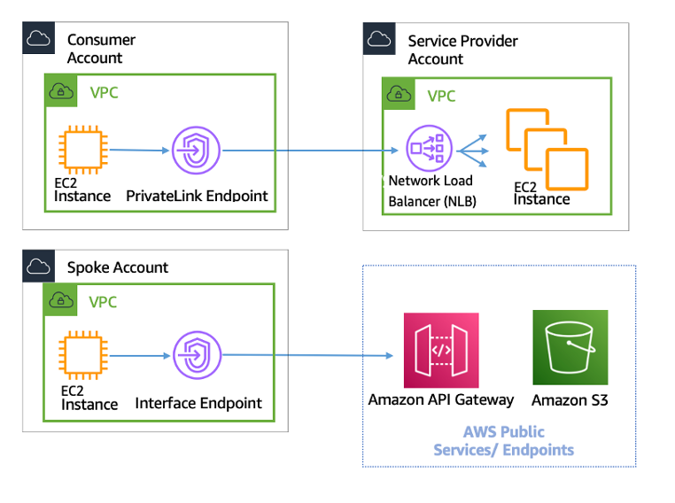

There are 3 ways for connecting VPCs

(1) VPC peering  
--> Use Case: erlaubt es traffic zwischen VPCs zu routen, als ob sie im selben Netzwerk sind
--> ermöglicht volle bidirectionale Verbindung zwischen VPCs
--> Kosten für Traffic über die Connection

(2) Connecting AWS VPCs with an AWS Transit Gateway  
--> Hub and Spoke System (d.h. es gibt einen zentralen Knoten (Hub) der die VPCs (Spokes) miteinander verbindet)

(3) AWS Private Link  
  
--> empfohlen, wenn VPCs verbunden werden sollen, aber nur der Consumer die Verbindungen initiieren soll  

https://docs.aws.amazon.com/whitepapers/latest/building-scalable-secure-multi-vpc-network-infrastructure/aws-privatelink.html  

https://docs.aws.amazon.com/whitepapers/latest/aws-vpc-connectivity-options/amazon-vpc-to-amazon-vpc-connectivity-options.html  

## when to use what?
AWS PrivateLink: Wenn man ein Client/Server Setup hat (bei dem nur der Client unidirektional auf eine Ressource zugreifen können soll)
VPC peering and Transit Gateway: Wenn man Layer3 IP Connectivity zwischen den VPCs herstellen möchte

# Tasks
## 1. Connect two VPCs with VPC peering, one should provide a Webserver, the other one should have access to this server

## 2. Connect two VPCs with AWS privatelink, one should provide a Webserver, the other one should have access to this server