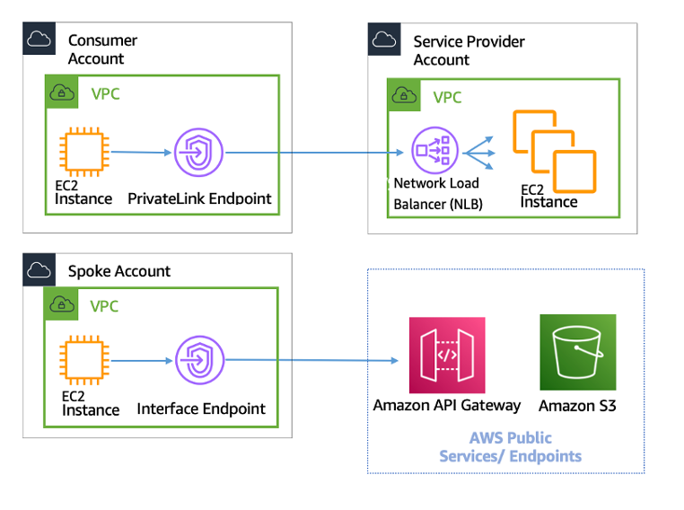

There are 3 ways for connecting VPCs

(1) VPC peering  
--> Use Case: erlaubt es traffic zwischen VPCs zu routen, als ob sie im selben Netzwerk sind
--> ermöglicht volle bidirectionale Verbindung zwischen VPCs
--> Kosten für Traffic über die Connection

(2) Connecting AWS VPCs with an AWS Transit Gateway  
--> Hub and Spoke System (d.h. es gibt einen zentralen Knoten (Hub) der die VPCs (Spokes) miteinander verbindet)

(3) AWS Private Link  
  
--> empfohlen, wenn VPCs verbunden werden sollen, aber nur der Consumer die Verbindungen initiieren soll  

https://docs.aws.amazon.com/whitepapers/latest/building-scalable-secure-multi-vpc-network-infrastructure/aws-privatelink.html  

https://docs.aws.amazon.com/whitepapers/latest/aws-vpc-connectivity-options/amazon-vpc-to-amazon-vpc-connectivity-options.html  

## when to use what?
AWS PrivateLink: Wenn man ein Client/Server Setup hat (bei dem nur der Client unidirektional auf eine Ressource zugreifen können soll)
VPC peering and Transit Gateway: Wenn man Layer3 IP Connectivity zwischen den VPCs herstellen möchte

# Tasks
## 1. Connect two VPCs with VPC peering, one should provide a Webserver, the other one should have access to this server
run terraform:  
```
terraform plan -var 'mode_vpc_peering=true'
```

## 2. Connect two VPCs with AWS privatelink, one should provide a Webserver, the other one should have access to this server
(1) Create an Endpoint Service (Provider Side)
(1.1) Create a Target Group
(1.2) Create a Network Load Balancer (NLB)
(1.3) Create an Ednpoint Service
(1.4) Allow the NLB to access the Webservice (configure Security Groups)

(2) Connect to the Endpoint Service (Consumer Side)
(2.1) --> VPC --> Endpoints --> Create Endpoint 
    --> Service category: Other endpoint services 
    --> Service name: DNS Name of the service
    --> VPC: select the Consumer VPC
    --> Subnet: choose one
    --> IP: IPv4
(2.2) Configure Security Group
    --> the Endpoint will create an ENI, which is associated with a Security Group
    --> allow INBOUND traffic to the Port where the Service is running on (Port 80 in our example)

(3) Accept the Endpoint Connection Request (Provider Side)

(4) Nimm den DNS Namens des Endpoints (nicht des Endpoint services) (Consumer Side)
curl -v /<Endpoint DNS/>
--> check Security Groups if not working

https://www.youtube.com/watch?v=0bHXWIM4_0o

Info: The Endpoint Service is only available in the AZ(s) in which it is deployed
--> you cannot access the Endpoint Service from an AZ, in which it is not deployed 


See: https://docs.aws.amazon.com/vpc/latest/privatelink/create-endpoint-service.html

run terraform:  
```
terraform plan -var 'mode_vpc_private_link=true'
```